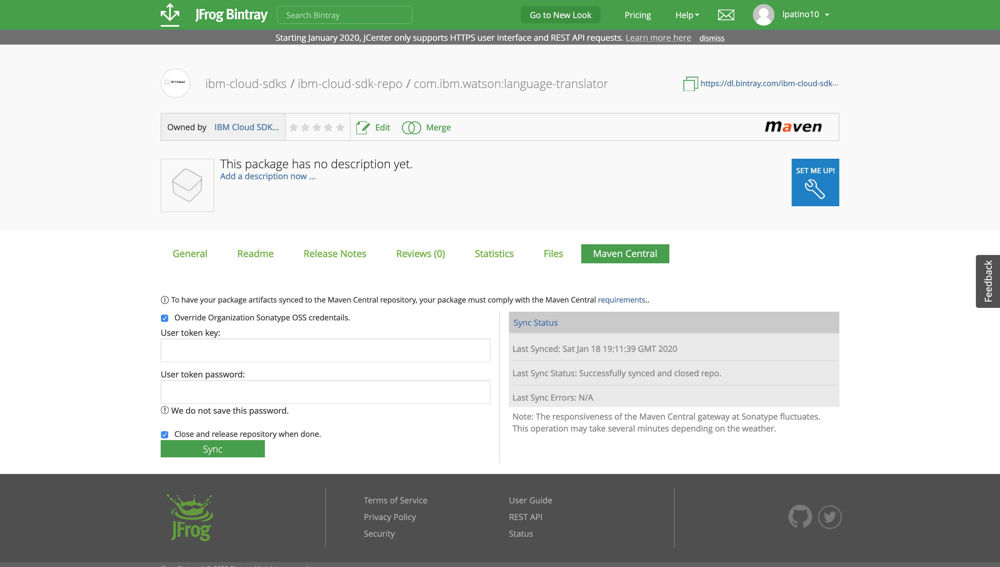
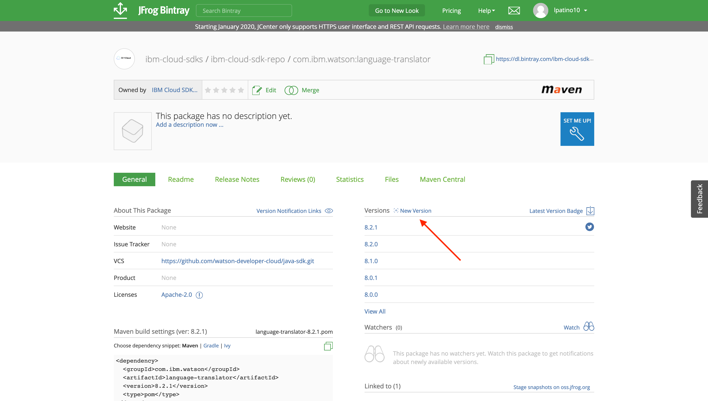
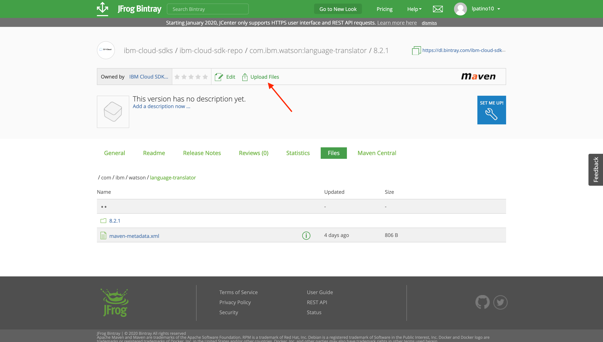

# Release process

The Java SDK has been configured so that releases should happen **automatically**.

If everything goes smoothly, commits to `master` should trigger new package versions using [semantic-release](https://github.com/semantic-release/semantic-release), which bases the release type (major, minor, patch, none) on the commit messages, which should always follow the [Conventional Commits specification](https://www.conventionalcommits.org/en/v1.0.0/).

When new versions are released, the code is pushed to Bintray and synced to Maven Central. The packages can be found [here](https://bintray.com/ibm-cloud-sdks/ibm-cloud-sdk-repo) on Bintray and [here](https://search.maven.org/search?q=com.ibm.watson) on Maven Central.

The Javadocs for the new version should also be pushed automatically. Docs are located in the `gh-pages` branch of the repo, and that gets synced to the following GitHub Pages link: http://watson-developer-cloud.github.io/java-sdk/

If things **don't** go smoothly, you'll need to follow some other instructions to get things in order.

## Fixing broken releases

### Travis timeouts

The most common reason for a release to fail is because of a Travis timeout. Builds are only allowed to run for a maximum of 1 hour, and unfortunately the syncing process between Bintray and Maven Central can be slow enough to go over this time limit sometimes. If this happens, you should do the following:

- Navigate to the code on Bintray at [this URL](https://bintray.com/ibm-cloud-sdks/ibm-cloud-sdk-repo). If you're not a member of the ibm-cloud-sdks organization, ask the maintainer of this SDK repo for access.
- Navigate to the "Maven Central" tab in each of the packages that didn't sync. Here's an example: https://bintray.com/ibm-cloud-sdks/ibm-cloud-sdk-repo/com.ibm.watson%3Alanguage-translator#central. You can figure out which packages to sync manually by checking the failed Travis build log or by looking at the "Last Synced" date for the package.
- Click the "Sync" button. If you need to provide Sonatype credentials, you can also ask the maintainer of this SDK repo for those.

    

- After doing this with all of the necessary packages, you can verify that things worked by checking the available versions on [Maven Central](https://search.maven.org/search?q=com.ibm.watson). This could take up to an hour.

### Unsuccessful Bintray deployment

This case is much more unlikely, since integration tests don't run on `master` and builds are very unlikely to be passing in a PR but fail once it's merged. Nevertheless, if this does happen and files aren't deployed to Bintray, you'll need to follow some steps to do this manually:

- Navigate to the code on Bintray at [this URL](https://bintray.com/ibm-cloud-sdks/ibm-cloud-sdk-repo). If you're not a member of the ibm-cloud-sdks organization, ask the maintainer of this SDK repo for access.
- For each package in the SDK, if the new version isn't present, you can add it by navigating to the package and adding it manually:

    

- To add the files, make sure to first generate all of the necessary artifacts locally. Check out the new release tag and generate them with the following commands (from the SDK repo):
  ```
  git checkout {release tag}
  ./gradlew shadowJar
  ```
- In the new version of the package on Bintray, add the files with the "Upload Files" button. Follow the file structure of previous releases to ensure everything works properly. The files to add should be in the `build/libs` folder of each local package in the SDK.

    

- Finally, be sure to sync the artifacts with Maven Central. You can look at the [Travis timeouts](#travis-timeouts) section above for more information on this.
